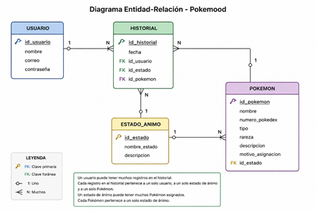

## tituilo de la aplicacion
* "Pokemood" *

  ## Objetivo de Pokemood
Introducción

En la actualidad, las aplicaciones digitales forman parte importante de la vida cotidiana y se han convertido en herramientas útiles para facilitar diferentes actividades, incluyendo el bienestar emocional y la organización personal. Muchas personas buscan una forma más dinámica e interactiva de expresar como se sienten, especialmente mediante aplicaciones que resulten entretenidas y fáciles de usar. 
El proyecto Pokemood surge como una propuesta que combina tecnología, entretenimiento y reconocimiento emocional utilizando la temática de Pokémon. La aplicación permitirá que los usuarios registren sus estados de animo diarios y reciban un Pokémon relacionado, tomando en cuenta las características y personalidad de cada uno.
Para el desarrollo de este proyecto se utilizarán herramientas como Flet para la creación de la interfaz multiplataforma, Python como lenguaje de programación y la PokéAPI para obtener información relacionada con los Pokémon. Asimismo, se implementará una base de datos relacional en HeidiSQL para almacenar la información de usuarios, emociones e historial emocional.
Con este proyecto se busca ofrecer una experiencia diferente y creativa para el registro de emociones, haciendo que los usuarios interactúen con la aplicación de una manera más atractiva y entretenida.

Descripción
Pokemood es una aplicación multiplataforma desarrollada con la librería Flet que tiene como objetivo ayudar a los usuarios a registrar y comprender sus estados de ánimo de una manera dinámica e interactiva utilizando la temática de Pokémon.
La aplicación permitirá que los usuarios seleccionen cómo se sienten diariamente y, dependiendo de la emoción registrada, el sistema asignará automáticamente un Pokémon que represente ese estado de ánimo. La elección del Pokémon estará basada en sus características, personalidad e historia. Por ejemplo, si el usuario se siente triste, se le asignará a Mimikyu, debido a que este Pokémon desea parecerse a otro Pokémon y, al no poder serlo completamente, suele relacionarse con sentimientos de tristeza y soledad.
Además de mostrar el Pokémon relacionado con la emoción del usuario, la aplicación proporcionará información detallada sobre cada Pokémon, como su número en la Pokédex, tipo, nivel de rareza, descripción y el motivo por el cual fue asignado. Toda esta información será almacenada en una base de datos para crear un historial emocional organizado y fácil de consultar.
Con este proyecto se busca combinar tecnología, entretenimiento y bienestar emocional en una sola aplicación, haciendo que el registro de emociones sea más interesante y motivando a los usuarios a expresar cómo se sienten de una forma creativa e innovadora.

Propósito y Alcance del Proyecto
El propósito de Pokemood es desarrollar una aplicación utilizando la librería de Flet que permitirá que el usuario registre sus emociones diarias de una forma más entretenida e interactiva mediante la temática de Pokémon. La aplicación busca facilitar el reconocimiento de emociones y mantener un historial emocional organizado para que el usuario pueda consultar sus estados de ánimo registrados anteriormente.
El alcance de este proyecto incluye un desarrollo de interfaz amigable que permite a los usuarios, seleccionar emociones y visualizar el Pokémon asignado dependiendo el estado emocional elegido. Además, el sistema almacenara información detallada de cada Pokémon, incluyendo su numero de pokedex, tipo, rareza, descripción y motivo de asignación.
La aplicación contará con una base de datos relacional diseñada para mantener organizada toda la información relacionada con usuarios, emociones, Pokémon e historial emocional. También se implementarán relaciones entre tablas mediante claves primarias y foráneas para asegurar la integridad de los datos y evitar redundancia de información.
Entidades Detectadas
Usuario
Atributos:
	Id_usuario
	Nombre
	Correo
	Contraseña
Estado_animo
	Id_estado
	Nombre_estado
	Descripcion
Pokémon 
	Id_pokemon
	Nombre
	Numero
	tipo
	rareza 
	descripcion
	motivo_asignacion
	id_estado
Historial
	id_historial
	fecha
	id_usuario
	id_estado
	id_pokemon

Relaciones entre Entidades
	Un usuario puede tener muchos registros en el historial
	Un estado de animo puede relacionarse con varios Pokémon
	Un Pokémon pertenece a un estado emocional
	El historial almacena la relación entre usuario, emoción y Pokémon asignado
Normalización de la Base de Datos
La base de datos del proyecto Pokemood fue diseñada siguiendo principios básicos de normalización con el objetivo de evitar redundancia de información y mantener la integridad de los datos.
Cada entidad almacena únicamente la información necesaria y las relaciones entre tablas se realizan mediante claves foráneas, permitiendo una mejor organización y administración de la información dentro del sistema.

Diagrama Entidad-Relación
El diagrama entidad-relación representa la estructura de la base de datos de Pokemood.

  ## Integrantes
  - *Pineda Becerra Miguel Angel
  - correo electronico: 23308060610467@cetis61.edu.mx
  - Edad: 18
  - Especialida: Programacion
  - Instituto: CETis 61
  ## Fotografia
  -![Miguell]

  -*Santana Ruiz Kenia Alejandra
  - correo electronico: 23308060610371@cetis61.edu.mx
  - Edad: 18
  - Especialida: Programacion
  - Instituto: CETis 61
  ## Fotografia
  - ![Kenia]

